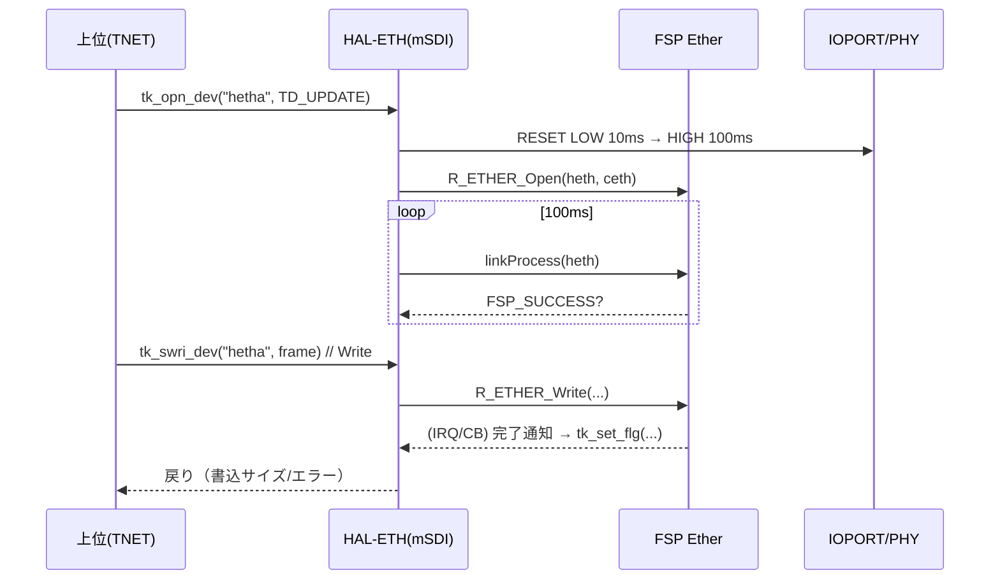

# HAL-ETH デバイスドライバ仕様書

## 1. 概要
本ドライバは **EK‑RA8D1 内蔵 Ethernet** を T‑Kernel デバイスとして公開する **HAL Ethernet ドライバ** である。  
T‑Kernel の mSDI（Multi-Sub device Interface）に準拠し、デバイス名 `DEVNAME_HAL_ETH` に **サフィックス a/b...** を付けた論理名（例: `hetha`）で Open/Read/Write を提供する。  
上位の **TNET タスク** は本デバイスを通じて **生イーサフレーム**（Ether/IP/UDP）を送出する。

- 対応 SoC/Board: **Renesas RA8D1 / EK‑RA8D1**
- 依存: **FSP Ether** (`R_ETHER_Open/Read/Write`, `g_ether0.p_api->linkProcess`), **IOPORT**（RESET制御）
- 条件コンパイル: `MTKBSP_RAFSP` かつ `DEVCNF_USE_HAL_ETH` 有効時のみビルド

---

## 2. 使用デバイス・モジュール
- **FSP**: `R_ETHER_*` API, `R_IOPORT_PinWrite`, `R_BSP_SoftwareDelay`
- **T‑Kernel**: デバイスAPI（`tk_opn_dev/tk_swri_dev` 互換）, 同期（**イベントフラグ**）, mSDI登録（`msdi_def_dev`）
- **ボード依存**: `ETH_A_RST`（既定）または `ETH_B_RST_CAM_D10`（切替可）で PHY/チップの RESET 信号を制御

---

## 3. 入出力仕様
### 3.1 デバイス名
- `DEVNAME_HAL_ETH` + `{ 'a' + unit }`（例: **`hetha`**）

### 3.2 Open / Read / Write
- **Open**: `dev_eth_openfn(ID devid, UINT omode, T_MSDI *msdi)`  
  - RESET シーケンス実施（`LOW 10ms → HIGH 100ms`）  
  - `R_ETHER_Open(...)` 実行、`g_ether0.p_api->linkProcess()` で **リンクアップ待機ループ**
- **Read**: `dev_eth_readfn(T_DEVREQ *req, ...)` → `read_data()`  
  - `R_ETHER_Read(heth, req->buf, &req->size)` → **イベントフラグ待ち** → `req->asize` 設定
- **Write**: `dev_eth_writefn(T_DEVREQ *req, ...)` → `write_data()`  
  - `R_ETHER_Write(heth, req->buf, req->size)` → **イベントフラグ待ち** → `req->asize` 設定

### 3.3 同期（イベントフラグ）
- 生成: `id_flgid = tk_cre_flg(&id_flg)`（`TA_TFIFO | TA_WMUL`）
- **ビット割当**: `1 << unit` を待受パターンに使用  
- 待受: `tk_wai_flg(..., TWF_ANDW | TWF_BITCLR, ..., DEV_HAL_ETH_TMOUT)`  
  - **注**: フラグ設定（割込み/コールバック側で `tk_set_flg`）は **本ファイル外** で行われる前提

---

## 4. 処理仕様

### 4.1 初期化・登録（`dev_init_hal_eth`）
1. `T_HAL_ETH_DCB` を確保し、mSDI 用 `T_DMSDI` を組み立てる  
   - `devnm = DEVNAME_HAL_ETH + 'a'+unit` / `openfn=dev_eth_openfn` / `readfn` / `writefn`
2. `msdi_def_dev(...)` で T‑Kernel デバイスを登録（戻り `idev`/`p_msdi` 取得）
3. `ether_cfg_t` をローカルコピー（`ceth_nc`）し `p_context` に DCB を詰める
4. イベントフラグ生成（`tk_cre_flg`）
5. DCB に `heth/ceth/devid/unit/evtmbfid` を保存

### 4.2 Open（`dev_eth_openfn`）
- **RESET**: `R_IOPORT_PinWrite(ETH_RESET_IO, LOW) → 10ms → HIGH → 100ms`
- **Open**: `R_ETHER_Open(heth, ceth)` を呼ぶ
- **リンク待ち**: `g_ether0.p_api->linkProcess(heth)` が `FSP_SUCCESS` になるまで **100ms 間隔でポーリング**

### 4.3 Read/Write（`read_data` / `write_data`）
- **事前**: `wflgptn = 1<<unit`, `tk_clr_flg(id_flgid, ~wflgptn)`
- **I/O**: `R_ETHER_Read` / `R_ETHER_Write`
- **完了待ち**: `tk_wai_flg(..., TWF_ANDW | TWF_BITCLR, ..., DEV_HAL_ETH_TMOUT)`  
  - 待ち成功後 `req->asize = req->size` を反映（Write は送信サイズ、Read は実受信サイズ）

---

## 5. データ構造（抜粋）
```c
typedef struct {
    ether_ctrl_t *heth;   // FSP Ether handle
    ether_cfg_t  *ceth;   // Ether config (p_context に DCB を設定)
    ID            devid;  // T‑Kernel device ID
    UINT          omode;  // Open mode
    UW            unit;   // Unit number (0..)
    ID            evtmbfid; // event MBF ID (msdi)
} T_HAL_ETH_DCB;

/* パケット I/O 受け渡し */
typedef struct {
    uint8_t  dst_mac[6];
    uint8_t  src_mac[6];
    uint16_t ethertype;
} ether_header_t;

typedef struct {
    uint8_t  ver_ihl, tos;
    uint16_t tot_len, id, frag_off;
    uint8_t  ttl, protocol;
    uint16_t checksum;
    uint8_t  src_ip[4], dst_ip[4];
} ip_header_t;

typedef struct {
    uint16_t src_port, dst_port;
    uint16_t length, checksum;
} udp_header_t;
```
> 本ドライバ自身は **フレーム構築を行わない** が、上位（TNET）がこれら構造体でフレームを構築し `tk_swri_dev("hetha", ...)` で送出する。

---

## 6. エラー処理
- **初期化失敗**（イベントフラグ生成、`msdi_def_dev` 失敗等）: エラーコード返却・確保領域解放
- **Open 失敗**: `R_ETHER_Open` 失敗 → `E_IO` 返却
- **リンク未確立**: `linkProcess` が成功しない場合はループ継続（設計上は必ずリンク確立を待つ）
- **Read/Write 失敗**: `R_ETHER_Read/Write` の戻りを `E_IO` にマップ
- **待受タイムアウト**: `tk_wai_flg(..., DEV_HAL_ETH_TMOUT)` で `E_TMOUT` などを上位へ返却

---

## 7. ログ出力
- Open 成否: `[TNET] device '%s' opened (dd=%d)`（上位で表示される例）
- エラー: `tk_opn_dev` 失敗、`E_IO`、タイムアウト等は `APP_ERR_PRINT` 等で出力（上位タスク側）

---

## 8. 既知の注意事項
1. **イベントフラグのセット側**（割込み/コールバックで `tk_set_flg`）は **本ファイル外** 実装に依存。I/O 完了通知の経路を必ず接続すること。  
2. **RESET ピン** は `ETH_A_RST` が既定。ハード構成により `ETH_B_RST_CAM_D10` を選択できる。  
3. **リンク待ち** はポーリング方式（100ms周期）。必要なら **リンクアップ割込み** へ置換可能。  
4. mSDI 登録名は `DEVNAME_HAL_ETH + unit`。上位のソースでは **`"hetha"`** を前提にしているため、変更時は参照箇所を更新。  
5. `DEVCNF_USE_HAL_ETH` が無効だとビルド対象外。BSP/プロジェクトの設定を確認。

---

## 9. シーケンス図


---

## 10. テスト項目
1. **登録/オープン**: `dev_init_hal_eth` が `E_OK` を返し、`tk_opn_dev("hetha")` が成功すること  
2. **RESET**: 10ms→100ms のトグルで PHY/チップが初期化されること（オシロ等で確認可）  
3. **リンク確立**: `linkProcess` でリンクアップすること（ケーブル/ハブ接続）  
4. **送受信**: `tk_swri_dev` / `tk_srea_dev` が `E_OK` を返し、イベントフラグ経由で完了すること  
5. **タイムアウト**: `DEV_HAL_ETH_TMOUT` 超過で `E_TMOUT` を返すこと  
6. **複数ユニット**: `unit` 毎にイベントフラグビットが分離して機能すること  
7. **統合動作**: TNET の UDP 送出が実ホストで受信できること（MAC/IP/PORT 整合）
