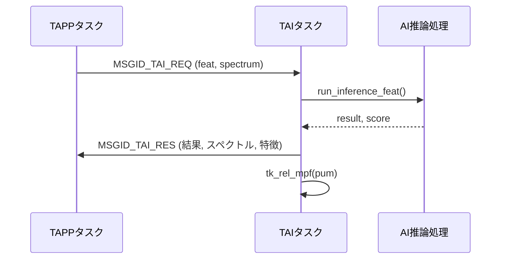

# TAIタスク仕様書

## 1. 概要
TAIタスクは、TAPPから受け取った16次元特徴量に対してAI推論を実行し、推論結果と可視化用128binスペクトルをTAPPへ返却する。  
本タスクはメールボックスによる非同期メッセージ受信を契機に動作し、内部で多層パーセプトロン（MLP）による推論を行う。

## 2. 使用デバイス・モジュール
- 推論モデル: 2層MLP (ReLU + Sigmoid)
- 活性化関数:
  - ReLU: max(0, x)
  - Sigmoid: 1 / (1 + exp(-x))
- メモリプール: MPFID_MEDIUM (応答メッセージ)
- メールボックス: MBXID_TAI (入力), MBXID_TAPP (出力)

## 3. 入出力仕様
### 入力
- 宛先タスク: TAI
- メッセージID: MSGID_TAI_REQ
- メッセージ構造体: msg_ai_req_t
  - tim: 計測時刻
  - feat[16]: 特徴ベクトル
  - spectrum[128]: スペクトルデータ
  - bin_hz: 周波数分解能

### 出力
- 宛先タスク: TAPP
- メッセージID: MSGID_TAI_RES
- メッセージ構造体: msg_ai_res_t
  - tim: 計測時刻
  - spectrum[128]: 入力スペクトルをコピー
  - feat[16]: 入力特徴ベクトルをコピー
  - label: 推論結果 (0: 正常, 1: 異常)
  - score: 異常スコア (0.0～1.0)
  - conf_anom: 異常確信度 (score)
  - conf_norm: 正常確信度 (1.0 - score)
  - bin_hz: 周波数分解能

## 4. 処理仕様
### 推論処理
1. 入力特徴量 (16次元) を1層目 (feat→hidden) に入力
   - sum = feat[i] * mlp_w0 + mlp_b0
   - 活性化関数: ReLU
2. hiddenを2層目に入力 (hidden→出力)
   - sum = hidden[j] * mlp_w1 + mlp_b1
   - 活性化関数: Sigmoid
3. 出力スコア (0.0～1.0) を算出
   - score >= 0.5 → label=1 (異常)
   - score < 0.5 → label=0 (正常)

### メイン処理
1. MBXID_TAIからメッセージ受信 (tk_rcv_mbx)
2. 受信メッセージがMSGID_TAI_REQであればAI推論を実行
3. 結果をmsg_ai_res_tに格納し、TAPPへ送信
4. 入力メッセージ用メモリを解放 (tk_rel_mpf)

### エラーハンドリング
- メッセージ受信エラー: ログ出力後continue
- メモリプール取得失敗: ログ出力、入力メッセージ解放
- 想定外メッセージID: エラーログ出力

## 5. データ構造
### 特徴ベクトル (msg_ai_req_t)
```c
typedef struct {
    SYSTIM tim;
    float32_t feat[16];
    float32_t spectrum[128];
    float32_t bin_hz;
} msg_ai_req_t;
```

### 推論結果 (msg_ai_res_t)
```c
typedef struct {
    SYSTIM tim;
    float32_t spectrum[128];
    float32_t feat[16];
    int8_t label;
    float32_t score;
    float32_t conf_anom;
    float32_t conf_norm;
    float32_t bin_hz;
} msg_ai_res_t;
```

## 6. エラー処理
- 受信失敗時: APP_ERR_PRINTでログ出力
- メモリ確保失敗時: ログ出力、入力メッセージ解放
- 不正msgid受信時: エラーログ出力

## 7. ログ出力
- [TAI started]
- [TAI] inference done: result=%d score=%d.%03d
- [TAI] rcv_mbx err=%d
- [TAI] get_mpf err=%d
- [TAI] unexpected msgid=%d

## 8. 既知の不具合・注意事項
- スコア算出のしきい値は0.5で固定されているが、運用で調整可能
- scoreの安定化パラメータ (TAI_SCORE_ALPHA, TAI_SCORE_FLOOR) が定義されているが、現状run_inference_feat内では未使用

## 9. シーケンス図


## 10. テスト項目
- MSGID_TAI_REQを受信後、MSGID_TAI_RESが返却されること
- scoreの範囲が0.0～1.0であること
- conf_anom + conf_norm ≈ 1.0となること
- 不正msgidを受信した場合、エラーログが出力されること
- メモリリークが発生しないこと
