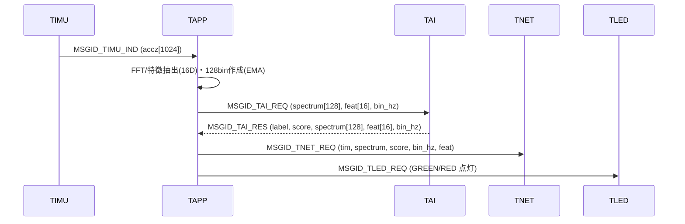

# TAPPタスク仕様書

## 1. 概要
TAPPタスクはアプリケーション全体のオーケストレータとして、TIMUからの加速度サンプルを受信し、
FFT・特徴抽出（16次元）を行ってTAIへ推論要求を送信、返却された推論結果とスペクトル等をネットワーク送信（TNET）し、
さらにLED制御（TLED）で判定を可視化する。

- サンプリング前提: FS=100Hz, FFT_N=1024, 片側512bin → 128binへ統合
- 可視化・転送: 128binスペクトル（EMA平滑）
- 推論入力: 16次元特徴量（ピーク・形状・帯域パワー・比・EMAなど）

---

## 2. 使用デバイス・モジュール
- 依存タスク: TIMU（センサ）, TAI（AI推論）, TNET（UDP送信）, TLED（LED制御）
- 数値演算: CMSIS-DSP (`arm_math.h`) を使用（RFFT等）
- RTOS: T-Kernel メールボックス / メモリプール
- 補助: `math.h`, `float.h`, `stdint.h`

---

## 3. 入出力仕様
### 入力（受信メッセージ）
- `MSGID_TIMU_IND` （差出: TIMU）  
  - 内容: `msg_imu_ind_t`（`tim`, `accz[1024]` など。Z軸整数サンプル想定）
- `MSGID_TAI_RES` （差出: TAI）  
  - 内容: `msg_ai_res_t`（`tim`, `spectrum[128]`, `feat[16]`, `label`, `score`, `conf_*`, `bin_hz`）
- `MSGID_TNET_RES`, `MSGID_TLED_RES`（差出: 各タスクの応答）

### 出力（送信メッセージ）
- `MSGID_TAI_REQ` （宛先: TAI）  
  - 内容: `msg_ai_req_t`（`tim`, `spectrum[128]`, `feat[16]`, `bin_hz`）
- `MSGID_TNET_REQ` （宛先: TNET）  
  - 内容: `msg_net_req_t`（`tim`, `spectrum[128]`, `score`, `bin_hz`, `feat[16]`）
- `MSGID_TLED_REQ` （宛先: TLED）  
  - 内容: `msg_led_req_t`（`led`, `pattern`, `blink_count`）

### メモリプール/メールボックス
- メモリプール:
  - `MPFID_LARGE` … `MSGID_TAI_REQ` 用（reqペイロード大）
  - `MPFID_MEDIUM` or `MPFID_USER_MSG` … `MSGID_TNET_REQ` 用（`send_net_req_ex` 内で取得）
  - `MPFID_SMALL` … `MSGID_TLED_REQ` 用
- メールボックス:
  - 受信: `MBXID_TAPP`
  - 送信: `MBXID_TAI`, `MBXID_TNET`, `MBXID_TLED`

---

## 4. 処理仕様

### 4.1 初期化（`init_task_tapp`）
1. 周辺タスク起動待ち (`tk_dly_tsk(100)`)
2. LED青点灯要求（起動確認）: `send_led_req(TRUE, TLED_BLUE, TLED_PAT_ON, 0)`
3. FFT初期化: Hann窓生成→`arm_rfft_fast_init_f32`
4. 前処理フィルタ初期化: HPF(一次), 必要時 LPF(二次Biquad)
5. スペクトルEMAバッファ初期化（`g_psd_ema`）

### 4.2 メインループ（`task_tapp`）
- `tk_rcv_mbx(MBXID_TAPP)` でメッセージ待受
- **`MSGID_TIMU_IND` 受信時**:
  1. **DC除去**: 入力1024サンプルの平均を算出し引き算（整数→float）
  2. **入力サニタイズ**: 非有限値/異常大値の除去（`sanitize_signal`）
  3. **Hann窓** 適用（事前生成）
  4. **RFFT** 実行（`arm_rfft_fast_f32`）→ 複素スペクトル `X`
  5. **パワー化**（片側512bin, DC/Nyqを個別処理）
  6. **正規化**: `1/N^2` と `E[w^2]=0.375` 補正、片側スペクトル補正（×2）
  7. **サニタイズ**（負値→0等, `sanitize_power`）
  8. **512→128 統合**: 4bin加算で128binへ圧縮
  9. **時間EMA平滑**（`EMA_BETA`）: 表示・判定の安定化（初回は生値コピー）
  10. **ローカルノイズ床**: 近傍中央値（`MED_WIN`）で床推定
  11. **ピーク抽出**: SNR最大ピーク（`pick_peak_snr`）
  12. **特徴抽出（16次元）**:
      - f0..2: ピーク周波数[Hz], SNR[dB], 半値幅[Hz]
      - f3..5: スペクトル重心/広がり/ロールオフ(0.85)
      - f6: フラットネス（幾何/算術比）
      - f7..11: 4Hz幅×5帯域の対数パワー（0–4,4–8,8–12,12–16,16–20Hz）
      - f12: 低域/高域 比（0–10Hz vs 10–25Hz, 対数比）
      - f13: ピーク顕著度（ピーク/床 比の対数）
      - f14,f15: ピーク周波数/ピークSNRのEMA
  13. **TAI要求**: `msg_ai_req_t` を作成し `send_ai_req(TRUE, &ai)`  
      - `spectrum[128]`: EMA後の128bin
      - `feat[16]`: 上記特徴
      - `bin_hz`: `50/128 = 0.390625` [Hz/bin]（FS=100Hz 前提）

- **`MSGID_TAI_RES` 受信時**:
  1. `msg_ai_res_t` を受領
  2. **ネットワーク送信要求** `send_net_req_ex(result, &net)` を実行  
     - `net` には `tim`, `spectrum[128]`, `score`, `bin_hz`, `feat[16]` を格納
  3. **LED制御**: `result==0`（安全）→緑点灯／`result!=0`（危険）→赤点灯（他色はOFF）

- **`MSGID_TNET_RES` / `MSGID_TLED_RES` 受信時**: ログ表示のみ

- **メッセージ解放**: `tk_rel_mpf(pum->mpfid, pum)`

### 4.3 送信ユーティリティ
- **AI要求**（`send_ai_req`）: `MPFID_LARGE` から確保し `MBXID_TAI` へ送信
- **LED要求**（`send_led_req`）: `MPFID_SMALL` から確保し `MBXID_TLED` へ送信
- **ネットワーク要求**（`send_net_req_ex`）: `MPFID_USER_MSG` から確保し `MBXID_TNET` へ送信  
  - `USER_MSG_PYLOAD_SIZE` が定義されていれば payload 容量チェックを実施  
  - 未定義時は警告ログを出しつつ送信（メモリ設計前提で運用）

---

## 5. データ構造（抜粋）
> 厳密な定義は共通ヘッダに依存。ここではTAPPが扱う最小限のフィールドを示す。

```c
typedef struct {
    SYSTIM tim;
    UH accz[1024];
} msg_imu_ind_t;

typedef struct {
    SYSTIM tim;
    float32_t spectrum[128];
    float32_t feat[16];
    float32_t bin_hz;
} msg_ai_req_t;

typedef struct {
    SYSTIM tim;
    float32_t spectrum[128];
    float32_t feat[16];
    int8_t    label;     // 0:normal, 1:anomaly
    float32_t score;
    float32_t conf_anom;
    float32_t conf_norm;
    float32_t bin_hz;
} msg_ai_res_t;

/* 推定されるネット送信要求（TNET側に合わせて定義） */
typedef struct {
    SYSTIM tim;
    float32_t spectrum[128];
    float32_t feat[16];
    float32_t score;
    float32_t bin_hz;
} msg_net_req_t;
```

---

## 6. エラー処理
- `tk_rcv_mbx` 失敗: エラーログ出力・継続
- `tk_get_mpf` 失敗: エラーログ出力・処理中断（必要に応じて解放）
- `tk_snd_mbx` 失敗: エラーログ出力・確保済みブロックを解放
- サニタイズ: 非有限値/異常大は 0 に置換（電安）

---

## 7. ログ出力
- 起動: `[TAPP started]`
- 受信: `rcv_mbx TAPP:[%d]` / `rcv_mbx TAPP:[%d][%d]`
- 監視: `[MON] hann`, `[MON] x(hann)`, `[MON] X(ri)`, `[MON] P512(nrm)`, `[MON] SPEC128(raw)`, `[MON] SPEC128(ema)`
- エラー: `error rcv_mbx:%d`, `error get_mpf:%d`, `error snd_mbx:%d`, `error rel_mpf:%d`
- 送信系: `send_net_req_ex: WARN: ...` / `payload too large ...` など

---

## 8. 既知の不具合・注意事項
- `USER_MSG_PYLOAD_SIZE` が未定義の場合、`send_net_req_ex` は容量チェックをスキップするため、
  メモリプール設計（`user_msg_t` の payload サイズ）と整合していることが前提。
- LPF係数は初期値であり、運用に合わせて最適化可能（必要時のみ有効化）。
- BIN幅（`bin_hz`）は FS=100Hz 前提で `0.390625 Hz/bin`。FS変更時は要再計算。
- 128binは512binの4:1統合（単純和）。重み付けや他のダウンサンプリング手法に差し替え可能。
- LED点灯は `pum->result` に依存（0:緑, ≠0:赤）。異論があれば `label` を参照する設計に変更可。

---

## 9. シーケンス図


---

## 10. テスト項目
1. **FFT前処理**: DC除去後の平均≈0、Hann窓min/maxレンジ妥当
2. **RFFT/電力**: 片側512binの計算・正規化が期待通り（DC/Nyq処理含む）
3. **128bin統合**: 512→128の総パワー保存性（誤差は正規化・片側補正の影響内）
4. **EMA**: 初回=生値、2回目以降は `EMA_BETA` に従い平滑化
5. **特徴抽出**: 16Dの各要素が有限値で範囲妥当（NaN/Inf無し）
6. **TAI往復**: `MSGID_TAI_REQ` → `MSGID_TAI_RES` のラウンドトリップが成立
7. **TNET送出**: `msg_net_req_t` に `score/bin_hz/feat` が入っていること
8. **LED表示**: 判定0で緑ON/赤OFF、判定1で赤ON/緑OFF
9. **資源管理**: すべてのメッセージで `tk_rel_mpf` が行われ、リークが無いこと
10. **異常系**: `tk_get_mpf / tk_snd_mbx / tk_rcv_mbx` エラー時のログ・解放処理が適切

---

### 付録: 主要定数（抜粋）
```c
#define FS_HZ     100.0f
#define FFT_N     1024
#define BIN_OUT   (FFT_N/2)   // 512
#define BIN128    128
#define BIN_HZ    (FS_HZ*0.5f / (BIN128-1))  // ≈ 0.390625
#define EMA_BETA  0.90f
#define MED_WIN   7
```
