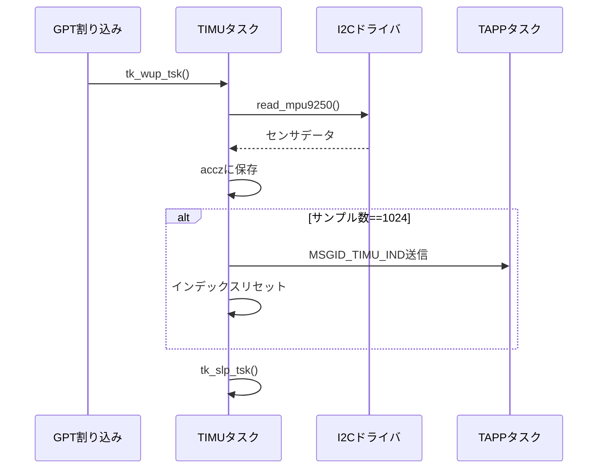

# TIMUタスク仕様書

## 1. 概要
TIMUタスクは、IMU(MPU-9250)から加速度を取得し、100Hz(10ms周期)でサンプリングを行う。
1024サンプルを収集した時点で、上位タスク(TAPP)へメッセージを通知する。
本タスクは、GPTタイマ割り込みによって周期動作し、I2Cデバイスドライバを通じてセンサデータを取得する。

## 2. 使用デバイス・モジュール
- IMUセンサ: TDK InvenSense MPU-9250
- 通信方式: I2C (デバイス名 "htiica", アドレス 0x68)
- タイマ: GPT (g_timer0)
- RTOS: T-Kernel
- メモリプール: MPFID_LARGE (固定長メモリ)
- メールボックス: MBXID_TAPP

## 3. 入出力仕様
### 入力
- GPT割り込み (10ms周期)
- I2C読み出しデータ (加速度XYZ, ジャイロXYZ, 温度)

### 出力
- 宛先タスク: TAPP
- メッセージID: MSGID_TIMU_IND
- メッセージ構造体: msg_imu_ind_t
  - tim: サンプリング開始時刻
  - accz[1024]: Z軸加速度サンプル配列

## 4. 処理仕様
### 初期化処理
1. GPTタイマ初期化 (init_gpt)
   - 割り込みハンドラ登録
   - 10ms周期で起動
2. I2Cデバイスオープン
   - tk_opn_dev("htiica", TD_UPDATE)
3. 加速度設定確認 (check_accel_config)

### メイン処理
1. 周期ごとにtk_slp_tskで待機、GPT割り込みで起床
2. IMUデータをread_mpu9250で取得
3. Z軸加速度をバッファに保存
4. 1024サンプル収集後、send_imu_indでTAPPへ通知

### 割り込み処理
- GPT割り込み (gpt_handler)
  - 割り込みフラグクリア
  - tk_wup_tsk(TSKID_TIMU)でタスク起床
  - R_BSP_IrqStatusClearでIRQクリア

## 5. データ構造
### mpu9250_data_t
```c
typedef struct {
    UH ax;
    UH ay;
    UH az;
    UH gx;
    UH gy;
    UH gz;
    UH temp;
} mpu9250_data_t;
```

### msg_imu_ind_t
```c
typedef struct {
    SYSTIM tim;
    UH accz[1024];
} msg_imu_ind_t;
```

## 6. エラー処理
- I2Cアクセス失敗時: APP_ERR_PRINTでログ出力、サンプルスキップ
- メモリプール取得失敗時: エラーログ出力、エラーコード返却
- メッセージ送信失敗時: エラーログ出力、エラーコード返却

## 7. ログ出力
- [TIMU started]
- ACCEL_CONFIG = 0xXX -> FS_SEL = X -> ±2G/±4G/±8G/±16G
- IMU Read error: %d
- error get_mpf:%d
- error snd_mbx:%d

## 8. シーケンス図


## 9. テスト項目
- GPTが10ms周期で割り込み発生すること
- 1024サンプル収集後に約10.24秒ごとに通知されること
- ACCEL_CONFIG読出しが正常であること
- メッセージ送信が正しく行われること
- メモリプールリークが発生しないこと
