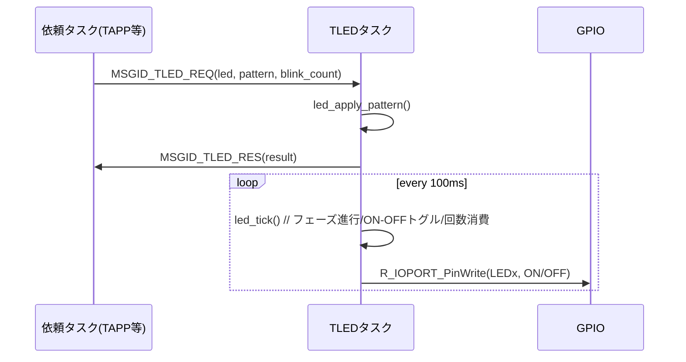

# TLEDタスク仕様書

## 1. 概要
TLEDタスクは、他タスクからの `MSGID_TLED_REQ` を受け取り、RA8D1評価ボード上のユーザLED（青/緑/赤）を独立制御する。
点灯/消灯に加え、**速点滅(100ms)**・**遅点滅(500ms)** をサポートし、点滅回数は有限回または無限回(`TLED_BLINK_INFINITE`)を扱う。
内部は **100ms周期** のタイマ・ティックで駆動される状態機械で構成される。

---

## 2. 使用デバイス・モジュール
- **MCU/ボード**: Renesas RA8D1 EK
- **GPIO/I/O**: FSP IOPORT (`R_IOPORT_PinWrite`, `g_ioport_ctrl`)
- **LED配線極性**: アクティブ High（`LED_ON_LEVEL = BSP_IO_LEVEL_HIGH`）
- **LEDピン**: `USER_LED1_BLUE`, `USER_LED2_GREEN`, `USER_LED3_RED`（FSP Configurator 定義を使用）
- **RTOS**: T‑Kernel（メールボックス/メモリプール）

---

## 3. 入出力仕様
### 入力（受信メッセージ）
- `MSGID_TLED_REQ`（差出: 任意タスク）  
  **ペイロード `msg_led_req_t`**（抜粋）
  - `led` : 対象LED（`0..TLED_NUM-1`）
  - `pattern` : `TLED_PAT_OFF / TLED_PAT_ON / TLED_PAT_BLINK_FAST / TLED_PAT_BLINK_SLOW`
  - `blink_count` : 点滅回数（有限回 or `TLED_BLINK_INFINITE=-1`）

### 出力（応答メッセージ）
- `MSGID_TLED_RES`（宛先: 要求元 `srctsk` を `dsttsk` に設定し返送）  
  ペイロードなし。`result` に `E_OK` またはエラーを格納。

### メールボックス／メモリプール
- 受信: `MBXID_TLED`（100msタイムアウト付きで `tk_rcv_mbx`）
- 応答送信: `MBXID_TAPP`（※本構成では TAPP が集約受信）
- 固定長メモリプール: `MPFID_SMALL`（REQ応答用ブロック確保）

---

## 4. 処理仕様

### 4.1 状態機械（1LEDあたり）
```c
typedef struct {
    tled_pattern_t  pat;         // 現在パターン
    W               blink_rem;   // 残り点滅回数 (-1: 無限)
    bool            is_on;       // 現在の出力状態
    UW              phase_ticks; // 現フェーズの残りTick数
} tled_sm_t;
```
- **Tick周期**: `TLED_TICK_MS = 100` ms
- **ブリンク周期（Tick単位）**  
  - 速点滅: `ON(1)→OFF(1)`（=100ms/100ms）  
  - 遅点滅: `ON(5)→OFF(5)`（=500ms/500ms）

### 4.2 初期化（`init_task_tled`）
1. 内部状態配列 `s_led[]` をゼロクリア  
2. 全LEDを `OFF` に適用（物理出力もOFF）

### 4.3 メインループ（`task_tled`）
1. `tk_rcv_mbx(MBXID_TLED, ..., TLED_TICK_MS)` で **100ms待ち** 受信
2. **受信成功 (`E_OK`)** かつ `MSGID_TLED_REQ` の場合：
   - `led_apply_pattern(led, pattern, count)` を呼び出す
   - `send_led_res(E_OK, pum->srctsk)` を返送
   - 異常パラメータ時は `send_led_res(E_PAR, pum->srctsk)`
   - 受信ブロックは `tk_rel_mpf` で解放
3. **タイムアウト (`E_TMOUT`)**：
   - `led_tick()` を1回実行し、各LEDの状態を1Tick進める  
     （フェーズ完了で **ON/OFFトグル**、ON に入ったタイミングで有限回なら `blink_rem--`）
   - `blink_rem==0` になったら **消灯(`OFF`)で終了**

### 4.4 パターン適用（`led_apply_pattern`）
- `OFF`: `is_on=false`, `phase_ticks=0`, 物理出力OFF
- `ON`:  `is_on=true`,  `phase_ticks=0`, 物理出力ON
- `BLINK_FAST`: `is_on=true`, `phase_ticks=TLED_FAST_ON_TICKS`, 物理出力ON から開始
- `BLINK_SLOW`: `is_on=true`, `phase_ticks=TLED_SLOW_ON_TICKS`, 物理出力ON から開始

---

## 5. データ構造（抜粋）
> 厳密な定義は共通ヘッダに依存。ここでは本タスクが扱う最小限の項目のみを示す。

```c
typedef enum {
    TLED_BLUE = 0,
    TLED_GREEN,
    TLED_RED,
    TLED_NUM
} tled_id_t;

typedef enum {
    TLED_PAT_OFF = 0,
    TLED_PAT_ON,
    TLED_PAT_BLINK_FAST,
    TLED_PAT_BLINK_SLOW
} tled_pattern_t;

typedef struct {
    UB led;          // tled_id_t
    UB pattern;      // tled_pattern_t
    W  blink_count;  // -1: 無限
} msg_led_req_t;
```

---

## 6. エラー処理
- `tk_rcv_mbx` 失敗：`APP_ERR_PRINT("TLED: rcv_mbx err=%d")` を出力し、短い遅延ののち再試行
- メモリプール確保失敗（`MPFID_SMALL`）：`APP_ERR_PRINT("TLED: get_mpf(SMALL) err=%d")` を出力
- 応答送信失敗：`APP_ERR_PRINT("TLED: snd_mbx err=%d")` を出力し、確保ブロックは解放

---

## 7. ログ出力
- 起動: `[TLED started]`
- エラー: `TLED: rcv_mbx err=%d`, `TLED: get_mpf(SMALL) err=%d`, `TLED: snd_mbx err=%d`
- （必要に応じ）想定外メッセージ: `TLED: unexpected msgid=%d`

---

## 8. 既知の不具合・注意事項
- 応答`MSGID_TLED_RES`は **TAPPのメールボックス** (`MBXID_TAPP`) に送られる設計。運用で応答ルーティングを変更する場合は `send_led_res` の宛先を調整すること。
- `TLED_BLINK_INFINITE` は `-1` を想定。共通ヘッダで定義・整合させること。
- LED極性は **アクティブ High** 前提。ハード差異がある場合は `LED_ON_LEVEL/LED_OFF_LEVEL` を調整。
- FSPのピン定義（`USER_LEDx_*`）が変更された場合、`kLedPin[]` を合わせて更新すること。

---

## 9. シーケンス図


---

## 10. テスト項目
1. `OFF/ON` が即時反映されること（ティック待ち不要）
2. 速点滅: 100ms周期で ON/OFF が交互に切替わること（ON:1tick/OFF:1tick）
3. 遅点滅: 500ms周期で ON/OFF が交互に切替わること（ON:5tick/OFF:5tick）
4. 有限回点滅: `blink_count` 回の **ON** で終了し、最終状態は **OFF** で停止すること
5. 無限点滅: `blink_count=-1` で継続動作すること
6. 異常パラメータ: 範囲外 `led`/`pattern` で `E_PAR` 応答となること
7. メモリ資源: `MPFID_SMALL` の確保/解放が漏れなく行われること
8. 応答ルーティング: `MSGID_TLED_RES` がTAPP側で受信できること
