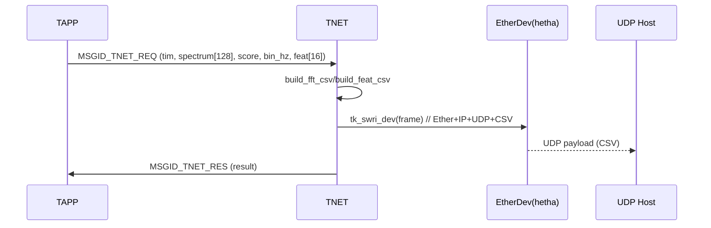

# TNETタスク仕様書

## 1. 概要
TNETタスクは、TAPPからの `MSGID_TNET_REQ` を受信してUDPパケットを生成・送信し、処理結果を `MSGID_TNET_RES` でTAPPへ返却する。  
UDPは片方向（応答なし）で、**生イーサネットフレーム**（Ether/IP/UDP）を自前で組み立てて送信する。  
送信ペイロードは主に **スペクトルCSV**（128bin; 必要に応じて間引き）と **特徴CSV**（16次元）の2種。

---

## 2. 使用デバイス・モジュール
- **低レベルEtherデバイス**: `"hetha"`（T‑Kernelデバイス名; `tk_opn_dev("hetha", TD_UPDATE)`）
- **プロトコル**: Ethernet(0x0800) / IPv4 / UDP(17)
- **MAC/IP/PORT**: ソース/デスティネーションはソースコード定数で定義（`SRC_MAC/DST_MAC/SRC_IP/DST_IP/SRC_PORT/DST_PORT`）
- **共通ヘッダ**: `user_res.h`, `tnet.h`（構造体/定数参照）
- **ユーティリティ**: `ip_checksum`, `htons`, `systim_to_u64`（環境マクロ `SYSTIM_TO_UD` があれば使用）

---

## 3. 入出力仕様
### 入力（受信メッセージ）
- `MSGID_TNET_REQ`（差出: TAPP）  
  **ペイロード `msg_net_req_t`（想定）**
  - `tim` : 計測時刻（`SYSTIM`）
  - `spectrum[SPEC_DIM]` : 128binスペクトル（TAPP→TAI→TAPP経由の値）
  - `score` : 推論スコア（0.0–1.0）
  - `bin_hz` : 1binあたり周波数刻み（例: 0.390625 Hz/bin）
  - `feat[FEAT_DIM]` : 16次元特徴ベクトル
  - （**注**）AIラベルは `user_msg_t.result` にも格納される前提

### 出力（応答メッセージ）
- `MSGID_TNET_RES`（宛先: TAPP）  
  - ペイロードなし、`result` に `E_OK` もしくはエラーコード

### メールボックス／メモリプール
- 受信: `MBXID_TNET`（`tk_rcv_mbx`）
- 応答: `MBXID_TAPP`（`send_net_res`）
- メモリプール: `MPFID_SMALL`（応答メッセージ確保）

---

## 4. 処理仕様

### 4.1 初期化（`init_task_tnet`）
1. 低レベルEtherデバイス `"hetha"` を `tk_opn_dev(..., TD_UPDATE)` でオープンしディスクリプタを保持  
   - 成功: `[TNET] device 'hetha' opened (dd=...)`  
   - 失敗: `[TNET] tk_opn_dev('hetha') failed: <err>`

### 4.2 メインループ（`task_tnet`）
1. `tk_rcv_mbx(MBXID_TNET, ..., TMO_FEVR)` で待受
2. `MSGID_TNET_REQ` を受信したら：
   - `ai_result = pum->result` を取り出し（AIラベル）
   - `msg_net_req_t *req = (msg_net_req_t *)&pum->pyload`
   - **スペクトルCSV** を生成してUDP送信
     - `build_fft_csv(...)`（従来形式） or `build_fft_csv_ex(...)`（拡張; score/bin_hz/feat同梱）
   - **特徴CSV** を生成してUDP送信（`build_feat_csv(...)`）
   - 送信結果に応じて `send_net_res(E_OK/E_IO/E_PAR)`
3. 受信ブロックは `tk_rel_mpf(pum->mpfid, pum)` で解放

### 4.3 UDP送信（生イーサ組み立て）
- `send_udp_packet(ID dd, const uint8_t* payload, uint16_t payload_len)`
  1. **Etherヘッダ**: dst/src MAC, EtherType=0x0800
  2. **IPヘッダ**: IHL=5(20byte), TTL=64, Protocol=17(UDP), `tot_len` 設定後 `ip_checksum` を計算
  3. **UDPヘッダ**: src/dst port, length（ヘッダ+payload）, checksum=0（未計算で送出）
  4. **Payload**: CSV文字列をコピー
  5. `tk_swri_dev(dd, 0, frame, total_len, &asize)` で送信

### 4.4 CSV生成
- 共通設定：
  - `LGXS_FS_HZ=100.0`, `LGXS_FFT_N=1024` → `LGXS_BIN_HZ=(FS/FFT)`
  - `LGXS_DOWNSAMPLE=4`（**間引き**: 4点ごとに1点をCSV化）
  - 浮動小数点表示: `LGXS_FLOAT_FMT="%.3f"`
- `build_fft_csv_ex(dst, cap, ts, spec, n, result, score, feat*, feat_dim, bin_hz)`
  - 先頭に `ts_us=<SYSTIM変換>,result,score,n,bin_hz,fft=` を付与
  - スペクトル値を `,` 区切りで列挙（間引き対応）
  - `,feat=` に続けて特徴ベクトルを列挙（任意）
- `build_feat_csv(dst, cap, ts, result, score, bin_hz, feat, feat_dim)`
  - `ts_us,result,score,bin_hz,feat=` の形式で列挙

---

## 5. データ構造（抜粋）
> 厳密定義は `user_res.h`/`tnet.h` を参照。ここでは TNET が扱う最小限の項目のみを示す。

```c
typedef struct {
    SYSTIM tim;
    float32_t spectrum[SPEC_DIM];  // 例: 128
    float32_t feat[FEAT_DIM];      // 例: 16
    float32_t score;
    float32_t bin_hz;
} msg_net_req_t;
```

---

## 6. エラー処理
- `tk_rcv_mbx` 失敗: `[TNET] rcv_mbx err:%d` を出力し `continue`
- `tk_get_mpf` 失敗: `[TNET] get_mpf err:%d` を出力し `return`
- `tk_snd_mbx` 失敗: `[TNET] snd_mbx err:%d` を出力（応答不可時）
- CSV生成失敗: `[TNET] build_fft_csv err:%d` を出力し `send_net_res(E_PAR)`
- `tk_swri_dev` 送信失敗: `send_net_res(E_IO)` を返却
- メモリ解放失敗: `[TNET] rel_mpf err:%d`

---

## 7. ログ出力
- 起動: `[TNET started]`
- デバイス: `[TNET] device 'hetha' opened (dd=...)`
- 受信エラー: `[TNET] rcv_mbx err:%d`
- 送信系: （必要に応じて）`[TNET] UDP sent %dB ...`（ソース内の条件付きログ）
- エラー: `[TNET] build_fft_csv err:%d`, `[TNET] UDP send error=%d`, `[TNET] snd_mbx err:%d`, `[TNET] rel_mpf err:%d`

---

## 8. 既知の不具合・注意事項
- **UDPチェックサムは未計算（0）** のまま送出している。ネットワーク機器によっては拒否される可能性があるため、必要に応じて UDP疑似ヘッダでのチェックサム計算を実装すること。
- 送信先の **MAC/IP/PORT はハードコード**。運用で変更する場合はビルド時定数または設定ファイル化を検討。
- CSVの **間引き係数 (`LGXS_DOWNSAMPLE`)** によりデータ量を削減している。帯域要件に応じて 2/4/8 等に調整する。
- `SYSTIM`→時刻（μs等）変換は `SYSTIM_TO_UD` に依存。環境に合わせて定義すること。
- `SPEC_DIM`/`FEAT_DIM` は共通定義に依存（本プロジェクトでは `128/16` を想定）。

---

## 9. シーケンス図


---

## 10. テスト項目
1. `"hetha"` デバイスが正常オープンされる（失敗時ログ）
2. `MSGID_TNET_REQ` 受信でCSVを生成し、`tk_swri_dev` が `E_OK` を返す
3. `SPEC_DIM=128` 時、CSVの `fft=` の要素数が `128/LGXS_DOWNSAMPLE` 程度になる（切詰め閾値で前後あり）
4. `build_feat_csv` にて `feat=16要素` が列挙される
5. 送信失敗時に `MSGID_TNET_RES(E_IO)` が返る
6. メモリリークが無い（受信ブロックは必ず `tk_rel_mpf` される）
7. 宛先MAC/IP/PORT変更後、想定ホストでUDP受信が確認できる
8. UDPチェックサム未計算でもネットワーク経路で通るか（通らない場合は実装追加）

---

### 付録A: スペクトルCSVフォーマット（例）
```
ts_us=1234567,result=1,score=0.873,n=128,bin_hz=0.390625,fft=0.002,0.015,0.081,...
```

### 付録B: 特徴CSVフォーマット（例）
```
ts_us=1234567,result=1,score=0.873,bin_hz=0.390625,feat=12.500,21.342,0.781,...(×16)
```
