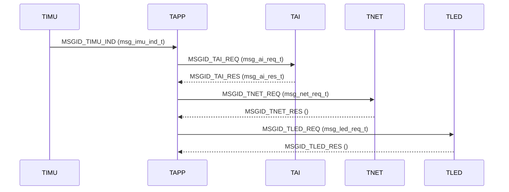

# ユーザリソース仕様書（user_res.h）

## 1. 概要
本仕様書は、LGX‑Shield アプリケーションにおける **T‑Kernel リソースの共通定義** をまとめたものである。  
対象は **タスクID／優先度／スタックサイズ、メールボックスID、固定長メモリプールIDとサイズ、メッセージID、共通メッセージ構造体、各メッセージのペイロード構造体** である。  
本定義により、TAPP/TIMU/TAI/TNET/TLED 間のタスク間通信（メールボックス＋固定長メモリ）を統一する。

---

## 2. 定義範囲・依存
- 対象ヘッダ: `user_res.h`
- RTOS: **T‑Kernel**（`T_MSG`, メールボックス/固定長メモリAPI）
- 他モジュール: TAPP/TIMU/TAI/TNET/TLED タスク実装
- 例外・前提: 本仕様は **静的割当** を前提とする（ID値はビルド時固定）。

---

## 3. タスク
### 3.1 タスクID（静的割当）
```c
typedef enum {
    TSKID_USRMAIN = 1, // 初期タスク
    TSKID_TAPP,        // アプリケーション
    TSKID_TAI,         // AI推論
    TSKID_TIMU,        // IMU取得
    TSKID_TNET,        // UDP送信
    TSKID_TLED,        // LED制御
    TSKID_NUM
} task_id_t;
```

### 3.2 タスク優先度（小さいほど高優先度）
```c
typedef enum {
    TPRI_TIMU = 5,   // 100Hz厳守のため最優先
    TPRI_TLED = 8,   // LED制御
    TPRI_TNET = 10,  // ネットワーク送信
    TPRI_TAI  = 12,  // 推論（やや重い）
    TPRI_TAPP = 20,  // 統括
    TPRI_NUM
} task_pri_t;
```

### 3.3 スタックサイズ（Byte）
```c
#define STKSZ_TAPP 4096
#define STKSZ_TAI  4096
#define STKSZ_TIMU 1024
#define STKSZ_TNET 2048
#define STKSZ_TLED 1024
```
> 実運用での余裕は、FFTやUDP組立てなどのピーク使用量に基づき適宜見直すこと。

---

## 4. メールボックス
### 4.1 メールボックスID（静的割当）
```c
typedef enum {
    MBXID_TAPP = 1,
    MBXID_TIMU,
    MBXID_TAI,
    MBXID_TNET,
    MBXID_TLED,
    MBXID_NUM
} mbx_id_t;
```

---

## 5. 固定長メモリプール
### 5.1 プールID・想定サイズ
```c
typedef enum {
    MPFID_LARGE = 1, // 2080B級（IMU 1024点など）
    MPFID_MEDIUM,    // 1024B級（FFT等）
    MPFID_SMALL      // 32B級（制御/応答）
} mpf_id_t;
```
### 5.2 個数・ブロックサイズ
```c
#define MPFNUM_LARGE  4
#define MPFSZ_LARGE  ((1024 * sizeof(UH)) + 64)

#define MPFNUM_MEDIUM 2
#define MPFSZ_MEDIUM ((512 * sizeof(float32_t)) + 64)

#define MPFNUM_SMALL 16
#define MPFSZ_SMALL  32
```
> `user_msg_t` の **payload** が収まることを前提に各プールのブロックサイズを定義。  
> 64Bのヘッダ余裕を見込んでいる。`sizeof(user_msg_t)` の実体に依存するため、共通ヘッダ変更時は再計算すること。

---

## 6. メッセージ
### 6.1 メッセージID
```c
typedef enum {
    MSGID_NONE = 0,
    MSGID_TIMU_IND, // TIMU→TAPP: IMUデータ塊
    MSGID_TAI_REQ,  // TAPP→TAI: 推論要求
    MSGID_TAI_RES,  // TAI→TAPP: 推論応答
    MSGID_TNET_REQ, // TAPP→TNET: UDP送信要求
    MSGID_TNET_RES, // TNET→TAPP: UDP送信応答
    MSGID_TLED_REQ, // TAPP→TLED: LED制御要求
    MSGID_TLED_RES, // TLED→TAPP: LED制御応答
} msg_id_t;
```

### 6.2 共通メッセージヘッダ
```c
typedef struct {
    T_MSG hdr;   // T‑Kernelヘッダ
    ID    msgid; // msg_id_t
    ID    srctsk;
    ID    dsttsk; // 未使用時はTNULL
    INT   result; // 追加情報/判定結果等
    ID    mpfid;  // 返却に用いるプールID
    UB    pyload; // ペイロード先頭（実体は可変）
} user_msg_t;
```
> **payload** は可変長領域として運用。実際の型（`msg_*_t`）を `&pum->pyload` を適切にキャストしてアクセスする。

---

## 7. 構造体定義（ペイロード）
### 7.1 共通定数
```c
#define IMU_REC_MAX 1024
#define FEAT_DIM    16
#define SPEC_DIM    128
```

### 7.2 TIMU→TAPP
```c
typedef struct {
    SYSTIM tim;
    UH     accz[IMU_REC_MAX]; // Z軸 1024点（整数）
} msg_imu_ind_t;
```

### 7.3 TAPP→TAI（推論要求）
```c
typedef struct {
    SYSTIM tim;                 // TAPP計測時刻を継承
    float  feat[FEAT_DIM];      // 16次元特徴
    float  spectrum[SPEC_DIM];  // 128bin PSD(EMA)
    float  bin_hz;              // 1bin周波数刻み (例: 0.390625)
} msg_ai_req_t;
```

### 7.4 TAI→TAPP（推論応答）
```c
typedef struct {
    int8_t label;      // 0=safe, 1=danger
    float  score;      // 0..1
    float  conf_anom;  // = score
    float  conf_norm;  // = 1 - score

    // 既存コード参照フィールド（REQから継承）
    SYSTIM tim;
    float  spectrum[SPEC_DIM];
    float  bin_hz;
    float  feat[FEAT_DIM];
} msg_ai_res_t;
```

### 7.5 TAPP→TNET（UDP送信要求）
```c
typedef struct {
    SYSTIM    tim;
    float32_t spectrum[SPEC_DIM]; // 128bin
    float     score;              // 0..1
    float     bin_hz;             // 例: 0.390625
    float     feat[FEAT_DIM];     // 16D
} msg_net_req_t;
```

### 7.6 TAPP→TLED（LED制御要求）
```c
typedef struct {
    UB led;          // tled_id_t
    UB pattern;      // tled_pattern_t
    W  blink_count;  // 点滅回数: 1以上 / TLED_BLINK_INFINITE
} msg_led_req_t;
```

---

## 8. 割り込み定義
```c
// TIMUの10msタイマ処理で使用（GPT0 オーバーフロー）
#define GPT_INTNO GPT0_COUNTER_OVERFLOW_IRQn
```

---

## 9. 運用・注意事項
- **プール整合**: 各メッセージの `sizeof(...)` が割当プールのブロックサイズに収まっていることを常に確認。  
  特に `msg_imu_ind_t`（IMU 1024点）と `msg_ai_req_t/msg_ai_res_t/msg_net_req_t` は **LARGE/MEDIUM** の境界に注意。
- **payloadアクセス**: `user_msg_t` の `pyload` は **先頭1バイト表現** のため、実際にはキャストでアクセスすること（例: `msg_ai_req_t *p = (msg_ai_req_t *)&pum->pyload;`）。
- **IDの連携**: `srctsk/dsttsk` は監視・デバッグ用途。ルーティングには主に **メールボックスID** を使用する。
- **優先度設計**: `TPRI_TIMU` を最上位にして 100Hz サンプリングのジッタを最小化。ネット送出と推論は `TNET > TAI` の順で即応性を確保。
- **バイナリ互換**: フィールド追加時は **末尾追加** が安全。既存タスクの `memcpy`/`sizeof` 依存コードに注意。

---

## 10. シーケンス（概略）


---

## 11. テスト項目
1. **ID整合**: タスク/メールボックス/プールIDが重複なく生成・参照できること
2. **サイズ整合**: 各 `msg_*_t` とプールサイズの整合（ビルド時アサート推奨）
3. **往復系**: `TIMU→TAPP→TAI→TAPP→TNET/TLED` のメッセージラウンドトリップ成立
4. **優先度**: 100Hzサンプリングに影響しないスケジューリングで動作
5. **メモリリーク**: すべての経路で `tk_rel_mpf` が実行されること
6. **互換性**: 将来のフィールド追加時にも既存バイナリと互換が保てる設計であること
